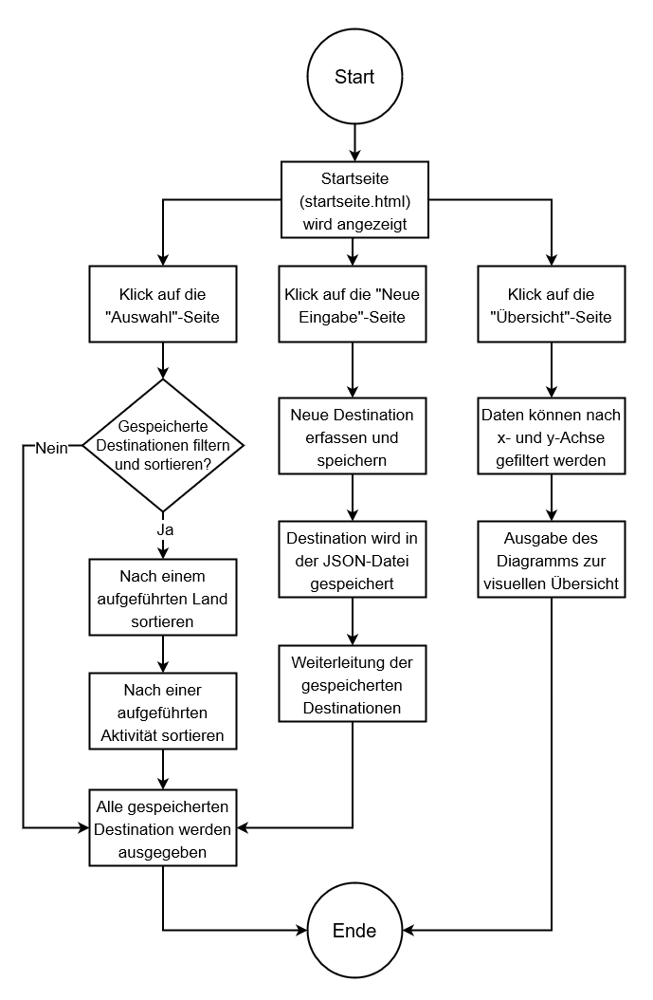

# Verwaltung von Feriendestinationen

## Ausgangslage der Problemstellung
Auf meinen Reisen mit dem Van bin ich bereits vielen schönen Destinationen begegnet, welche ich aber leider nie gross notiert hatte. Mithilfe dieser Webapplikation möchte ich eine Website schaffen, welche mir einen besseren und direkten Überblick über die schönsten besuchten oder auch gewünschten Destinationen verschafft. 

## Projektidee
Es gibt viele schöne Feriendestinationen in Europa. Doch welche sind für Camper/innen geeignet? Diese Seite soll nun also spezifisch für Camper/innen eine Lösung bieten, denn es schafft einen Überblick über die
besuchten Destinationen mit dem Camper und auch neue Wunsch-Spots für weitere Inspirationen können erfasst werden. 

## Funktionalität
Das Projekt beinhaltet einige Möglichkeiten. Eine Übersicht von relevanten Informationen:
- Möglichkeit zur Erfassung von neuen Spots, welche man bereits besucht hat oder noch möchte.
- Auflistung der erfassten Spots in Europa, um einen direkten Überblick über die gespeicherten Destinationen zu erhalten. 
- Die gespeicherten Destinationen können nach Land und Aktivität gefiltert werden, um die gewünschten Orte auf einem Blick zu erhalten. 

*Wie die Codes aufgebaut sind und welche Funktionen verwendet wurden, sind als Kommentare in den entsprechenden Files erfasst.*

## Ablauf des Programms

### 1. "Auswahl"-Seite
Bereits gespeicherte Feriendestinationen werden auf dieser Seite ausgegeben und können nach Land und/oder Aktivität gefiltert werden. Dabei wird auf die gleichen Daten zurückgegriffen wie bei der "Neue Eingabe"-Seite erfasst wurden.

### 2. "Neue Eingabe"-Seite
Erfassung einer neuen Feriendestination mit folgenden Daten:
- Ortschaft (Text-Feld)
- Region (Text-Feld)
- Land in Europa (Auswahl-Feld)
- Aktivität (Text-Feld)

Mit dem entsprechenden Button werden die Daten gespeichert, aber nur wenn alle erforderlichen Felder ausgefüllt wurden. 

### 3. "Übersicht"-Seite
Die Datensätze "Länder" und "Aktivitäten" sind in der x-Achse und y-Achse erfasst. Nach der Filterung werden die Daten als Diagramm ausgegeben, damit eine visuelle Übersicht der Feriendestinationen entsteht. 

## Workflow
Folgende Module werden importiert, damit die Web-Applikation korrekt funktioniert:
- Flask
- Plotly
- Pandas 

### 1. Dateneingabe
Die Dateneingabe kann durch zwei Wege erfolgen. Auf den entsprechenden Seiten des Programms kann man:
- neue Feriendestinationen erfassen
- die erfassten Feriendestinationen werden auf einer Seite angezeigt, um diese nach Land und Aktivität zu filtern

### 2. Speicherung
Die eingegebenen Feriendestinationen werden in einer JSON-Datei gespeichert und in der "Auswahl"-Seite direkt angezeigt. 

### 3. Datenverarbeitung
Die gefilterten werden mit den gespeicherten Feriendestinationen mittels For-Schleife verglichen, um diese in der "Auswahl"-Seite zu filtern. Zudem wird die Anzahl der Länder für das Diagramm ermittelt. 

### 4. Datenausgabe
- Ausgabe der gespeicherten Feriendestinationen
- Ausgabe der gefilterten Feriendestinationen
- Visuelle Darstellung der Feriendestinationen in einem Diagramm

## Mögliche zukünftige Erweiterungen des Programms
Damit das Tool noch mehr Nutzen erhält, könnte man folgende Erweiterungen vornehmen:
- Destinationen favorisieren (z.B. für zukünftige Reisen)
- Direkte Bearbeitung und auch Löschung der erfassten Destinationen auf der "Auswahl"-Seite
- Noch mehr Kriterien als Ausschluss zur Verfügung, um die Filterfunktion zu erweitern
- Nur die gefilterten Destinationen im Diagramm darstellen
- Vorschläge von ähnlichen Destinationen mit den gleichen Aktivitäten in anderen Ländern
- Angabe des Campers (Van, Wohnmobil, Wohnwagen usw.) für einen besseren Überblick, welche Orte für die jeweilige Grösse des Wagens geeignet ist.
